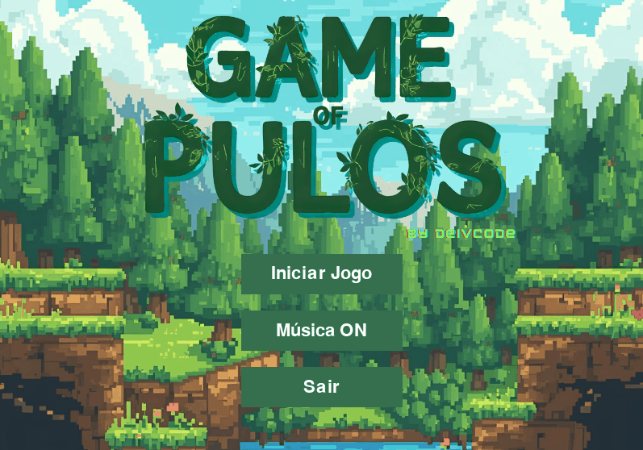

<<<<<<< HEAD
# 🎮 Game Of Pulos



"Game Of Pulos" é um jogo de plataforma 2D clássico, construído com Pygame Zero. O jogador controla um personagem que deve navegar por uma fase pulando em plataformas, evitando inimigos e coletando recompensas para alcançar o objetivo.

Este projeto representa o primeiro jogo em Python do autor, servindo como um exercício prático de aprendizado e desenvolvimento.

## ✨ Funcionalidades

-   🏃 **Movimentação do Jogador:** Controles clássicos de plataforma para andar e pular.
-   👾 **Inimigos:** Dois tipos de inimigos que reiniciam a fase ao serem tocados.
-   💎 **Itens Colecionáveis:** Diamantes e moedas com contadores na tela.
-   ↕️ **Objetos Interativos:** Plataformas móveis e de pulo.
-   🔄 **Estados de Jogo:** Ciclo completo com Menu, Gameplay, Game Over e Tela de Vitória.
-   🔊 **Controle de Som:** Botão para ligar/desligar música e efeitos sonoros.
-   🔁 **Reinício Automático:** O jogo reinicia a fase após o Game Over e volta ao menu após a vitória.

## 🚀 Como Executar o Jogo

### Pré-requisitos

-   Python
-   Pygame Zero

Você pode instalar o Pygame Zero usando o pip:
```bash
pip install pgzero
```

### Execução

Para rodar o jogo, execute o seguinte comando a partir do diretório raiz do projeto:

```bash
pgzrun game.py
```

## 🕹️ Controles

-   **Seta Esquerda:** Mover para a esquerda
-   **Seta Direita:** Mover para a direita
-   **Seta Cima:** Pular

## 📁 Estrutura do Projeto

-   `game.py`: Orquestrador principal do jogo e dos estados.
-   `menu.py`: Classes para o menu principal e seus botões.
-   `characters.py`: Lógica do jogador e dos inimigos.
-   `platformer.py`: Utilitário para carregar os mapas (`.csv`).
-   `*.csv`: Arquivos de dados que definem o layout do mapa. (Nota: O design do mapa foi originalmente prototipado no editor Tiled e depois adaptado para o formato CSV.)
-   `images/`, `music/`, `sounds/`: Pastas com os assets do jogo.

---

## ✅ Checklist de Requisitos

Esta seção documenta o cumprimento dos requisitos do projeto.

-   [x] **Bibliotecas Permitidas:** O projeto utiliza apenas `PgZero`, `math` e `random`.
-   [x] **Gênero do Jogo:** O jogo é um **Platformer**.
-   [x] **Menu Principal:** Possui um menu com botões para "Iniciar Jogo", "Ligar/Desligar Som" e "Sair".
-   [x] **Áudio:** O jogo implementa música de fundo e efeitos sonoros.
-   [x] **Inimigos:** Existem múltiplos tipos de inimigos perigosos.
-   [x] **Movimento de Inimigos:** Todos os inimigos possuem uma rotina de movimento.
-   [x] **Uso de Classes:** O código é estruturado em classes.
-   [x] **Animação de Sprites:** O herói e os inimigos usam animações de sprite.
-   [x] **Convenção de Nomes e PEP8:** O código segue as convenções do PEP 8.
-   [x] **Lógica do Jogo e Bugs:** O jogo possui uma mecânica lógica completa e funcional.
=======
# game-of-pulos-python
Meu primeiro jogo em Python! Um plataformer 2D simples criado com Pygame Zero.
>>>>>>> 965698f88684fbaf4bd652e16614fd5b7d9d541c
